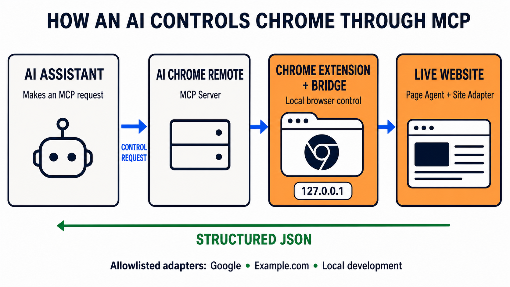
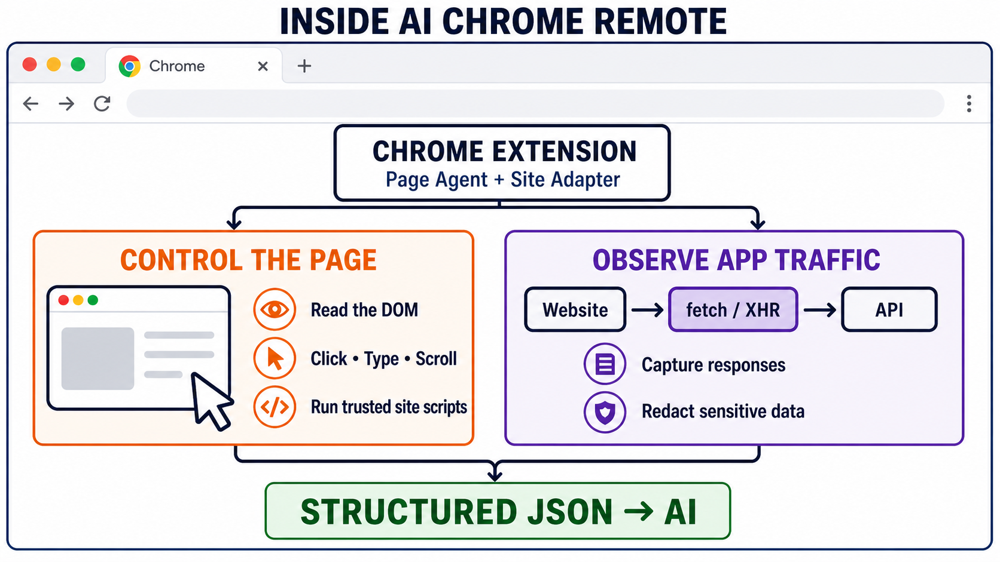

# AI Chrome Remote

AI Chrome Remote is a starter for building Chrome extensions that an LLM can control through MCP. It gives you the baseline bridge, observation tools, and extension points needed to build site-specific browser agents without baking a scraper into the core.



The base loop is:

1. Add a site folder to the allowlist.
2. Build and reload the extension.
3. Ask an MCP-capable LLM to open that site.
4. Inspect internal logs, captured network traffic, DOM snapshots, and screenshots.
5. Use generic actions like scroll, click, and type to explore the workflow.
6. Create a feature branch and add site-specific adapter actions only after the desired interaction is clear.

## What It Includes

- Manifest V3 Chrome extension with a page agent and network recorder.
- Chrome Native Messaging host launched by Chrome.
- Local token-protected bridge on `127.0.0.1`.
- MCP server exposing `chrome_remote_*` tools.
- Shared `AI remote control` tab group for tabs opened or targeted by the agent.
- Site-folder registry that generates Chrome host permissions and content-script matches at build time.
- Internal logs that are readable by MCP without needing DevTools console output.
- Generic browser controls: open URL, status, scroll, click, type, DOM snapshot, screenshot, network entries, jobs, and registered adapter actions.

## Inside AI Chrome Remote

The Chrome extension controls allowlisted pages while observing relevant application traffic, then returns structured JSON through the local MCP bridge.



## Quick Start

Replace `/path/to/ai-chrome-remote` in the examples below with the local path where you cloned this repository.

1. Build the project:

```bash
cd /path/to/ai-chrome-remote
npm install
npm run check
```

2. Load the extension in Chrome:

Open `chrome://extensions`, turn on Developer Mode, click **Load unpacked**, and select:

```text
/path/to/ai-chrome-remote/dist/extension
```

Copy the generated extension ID.

3. Install the native host:

```bash
npm run install:chrome -- --extension-id <chrome-extension-id>
```

Reload the extension in `chrome://extensions`.

4. Smoke test the local bridge:

```bash
npm run invoke -- host_status
npm run invoke -- open_url '{"url":"https://www.google.com/","active":true}'
npm run invoke -- tab_status
npm run invoke -- get_dom_snapshot '{"textMaxChars":2000,"elementLimit":50}'
npm run invoke -- get_network_entries '{"limit":20,"newestFirst":true}'
```

Chrome should create or reuse a tab group named `AI remote control`.

Google includes a site-specific adapter for search result extraction, result verticals, pagination, ranked result opening, and Google Maps place research. It also remains a useful smoke-test target for the generic observe-act-observe loop.

5. Add the MCP server to your MCP client:

```json
{
  "mcpServers": {
    "ai-chrome-remote": {
      "command": "node",
      "args": [
        "/path/to/ai-chrome-remote/dist/native-host/src/mcp-server.js"
      ]
    }
  }
}
```

## Use with Caution

Automated browsing may violate some websites' Terms of Service or trigger anti-abuse systems.

- Consider loading the extension in a separate browser profile, such as a dedicated Brave profile, instead of your everyday Chrome profile.
- For websites that require authentication, use a dedicated test account only when the site permits automation. Automated activity may cause an account to be restricted or banned.
- A reputable VPN can add a layer of network privacy, but it does not make prohibited automation safe or compliant.

## MCP Server

Run the MCP server over stdio:

```bash
npm run mcp
```

Useful starter tools:

- `chrome_remote_host_status`
- `chrome_remote_open_url`
- `chrome_remote_tab_status`
- `chrome_remote_get_logs`
- `chrome_remote_get_network_entries`
- `chrome_remote_get_dom_snapshot`
- `chrome_remote_capture_screenshot`
- `chrome_remote_scroll`
- `chrome_remote_click`
- `chrome_remote_type`
- `chrome_remote_run_adapter_action`

The MCP client owns model access. This extension does not store LLM API keys.

## Developing Site Adapters

Create a feature branch before adding support for a website:

```bash
git checkout -b feature/any-website-you-want-to-support
```

Add or edit a folder under `sites/`, rebuild, reload the extension, then use the generic MCP tools to explore the site before adding site-specific adapter actions.

### Adding a Site

Create a folder under `sites/`:

```text
sites/youtube/
  site.json
  guide.md        instructions for LLMs using this site adapter
  adapter.js       optional, add only when you are ready for site-specific actions
```

Minimal `site.json`:

```json
{
  "id": "youtube",
  "name": "YouTube Exploration",
  "description": "Allowlist-only fixture for exploring YouTube with generic remote-control tools.",
  "matches": [
    "https://www.youtube.com/*"
  ],
  "actions": []
}
```

Rebuild and reload the extension:

```bash
npm run build
```

Chrome requires host permissions and content-script matches to be static in the built manifest. The dynamic developer workflow is: add or edit a site folder, rebuild, reload the extension.

Each site folder should include a `guide.md` file. Use it to document how an LLM should operate that site: available adapter actions, expected inputs and outputs, pagination or scrolling patterns, important caveats, and the recommended observe-act-extract workflow. Keep site-specific usage instructions in the site folder so adapters remain drop-in and independently maintainable.

### Adding Site-Specific Actions

When exploration shows what the scraper needs, add an `adapter.js` in that site folder:

```js
(function() {
  'use strict';

  window.AiChromeRemote?.registerAdapter({
    id: 'youtube',
    actions: {
      readVisibleTitles() {
        return {
          titles: Array.from(document.querySelectorAll('a#video-title'))
            .map(el => el.textContent.trim())
            .filter(Boolean)
            .slice(0, 50)
        };
      }
    }
  });
})();
```

Then call it through MCP:

```json
{
  "action": "readVisibleTitles",
  "adapterId": "youtube"
}
```

The core intentionally does not allow arbitrary runtime JavaScript execution from MCP. Site-specific behavior should be reviewed as code in a site adapter.

## Repository Layout

```text
extension/      MV3 extension source
native-host/    Native Messaging host, MCP server, CLI helper, installer
shared/         Shared protocol and MCP tool definitions
sites/          Build-time allowlist and optional site adapters
examples/       Notes for adding adapter modules
scripts/        Build/copy/validation helpers
dist/           Generated runnable extension and native host
```

## Tab Group And Background Interaction

Tabs opened or targeted through the remote bridge are moved into a shared Chrome tab group named `AI remote control` when Chrome allows it.

Most commands target a stable `tabId`, so logs, network entries, DOM snapshots, scroll, click, type, and adapter actions can be routed to a non-frontmost tab. Screenshot capture uses `chrome.tabs.captureVisibleTab`, so Chrome requires the tab to be visible/active. Pass `activate:true` to `chrome_remote_capture_screenshot` if you want the extension to activate the tab before capture.

## Privacy And Safety Defaults

- No `<all_urls>` by default.
- No extension-side LLM keys.
- No arbitrary remote JavaScript execution.
- Network bodies are limited to metadata plus bounded JSON/text previews.
- Secret-looking headers and fields are redacted where the recorder can identify them.
- Logs stay internal unless console passthrough is explicitly enabled.
